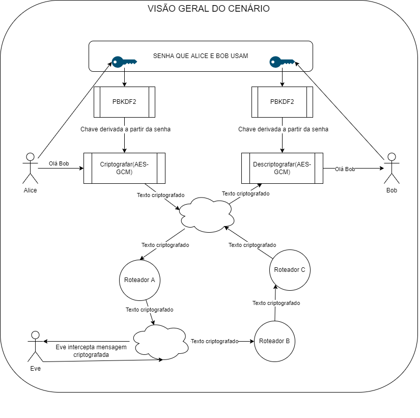

# Criptografia simétrica from scratch no navegador

O objetivo dessa demonstração é esclarecer como funciona uma troca de mensagens protegidas por criptografia simétrica.
O código será executado direto no navegador de internet, só precisamos de javascript puro.
Vamos demonstrar como:

* Derivar chaves
* Utilizando o AES para criptografar e descriptografar mensagens

Um exemplo de utilização de criptografia simétrica:

> Para ajudar na conversão dos bytes em string base64(e vice-versa) utilizamos o código encontrado em https://gist.github.com/enepomnyaschih/72c423f727d395eeaa09697058238727 ([base64.js](./base64.js)) que é uma implementação da [RFC 4648](https://www.rfc-editor.org/rfc/rfc4648).

